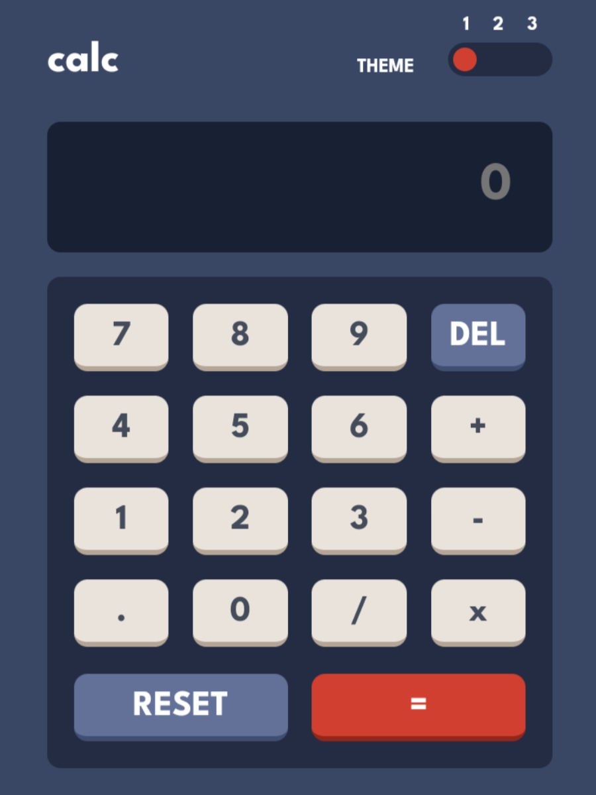
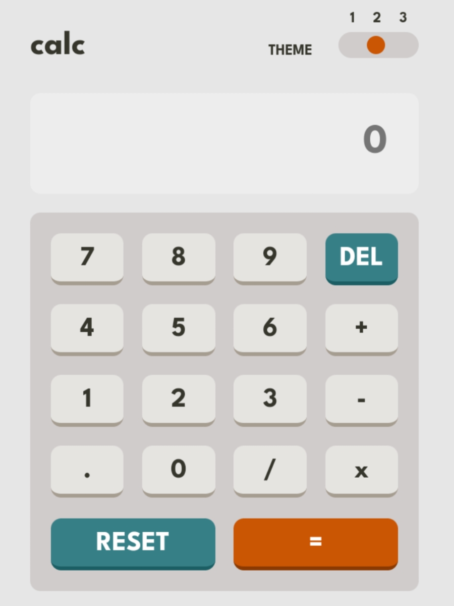
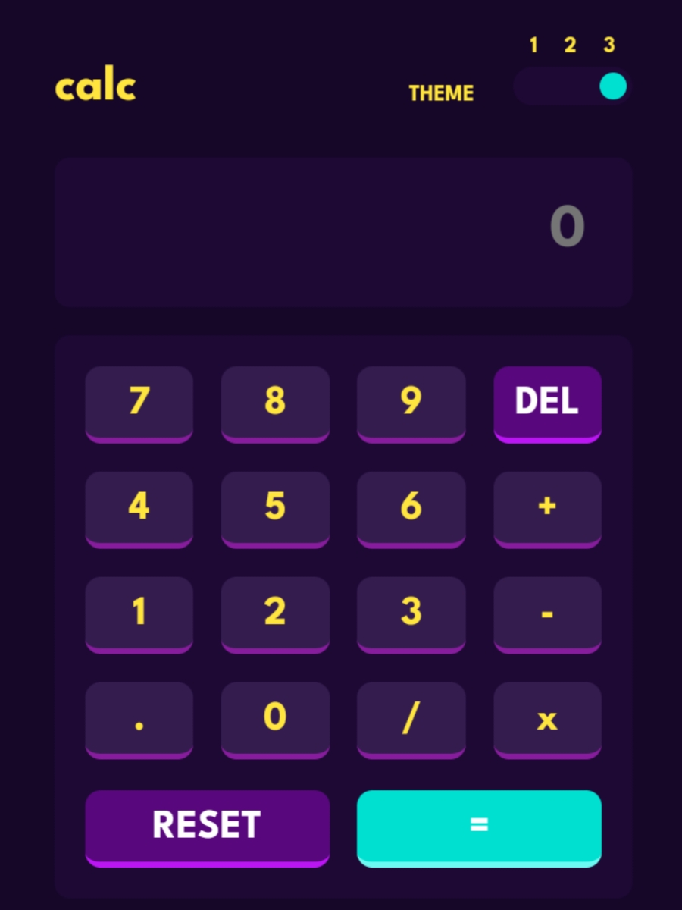

# Frontend Mentor Challenge - Calculator app solution
This is a solution to the [Calculator app challenge on Frontend Mentor](https://www.frontendmentor.io/challenges/calculator-app-9lteq5N29). Frontend Mentor challenges help you improve your coding skills by building realistic projects.

## Overview
This calculator app can perform the basic arithmetic operations - Addition, Subtraction, Multiplication, and Division.
There are three themes in-built in this app. You can switch to the desired theme by clicking on theme button.

Here are the screenshots of all the three different themes:

    
    
    

## Built with
- Semantic HTML5 markup
- CSS custom properties
- Flexbox
- CSS Grid

## How to Use
1. Enter a valid mathematical expression to calculate.
2. Click on equal button to calculate the result.
3. Click the DEL button to remove the last character.
4. Click the reset button the complete output.
5. Click on theme button to toggle between all the three themes.

## Contributing
I know my code is lacking most of the features. So pull requests are welcome for the major and minor changes